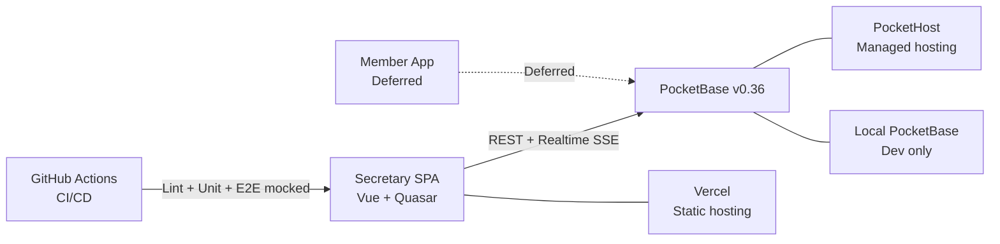
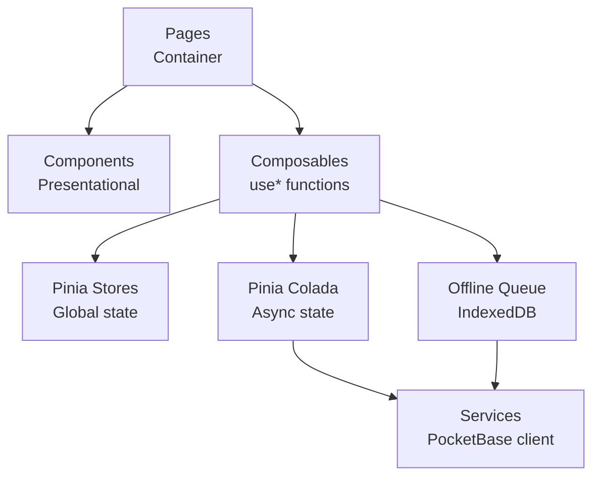
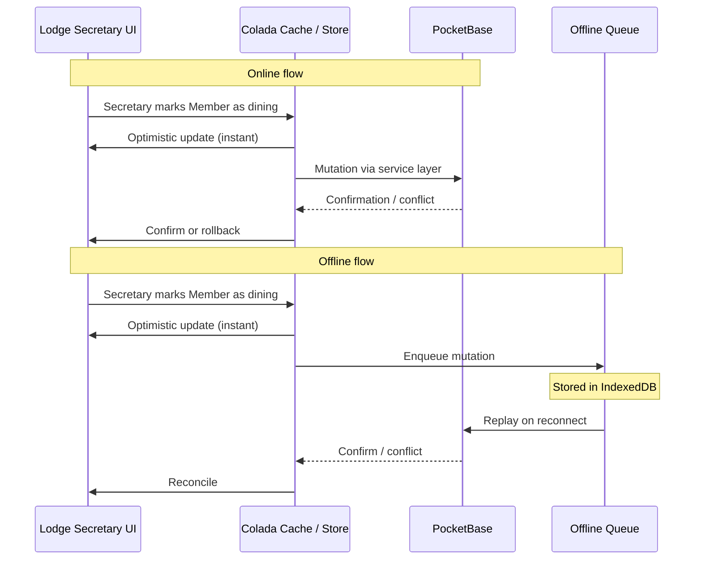
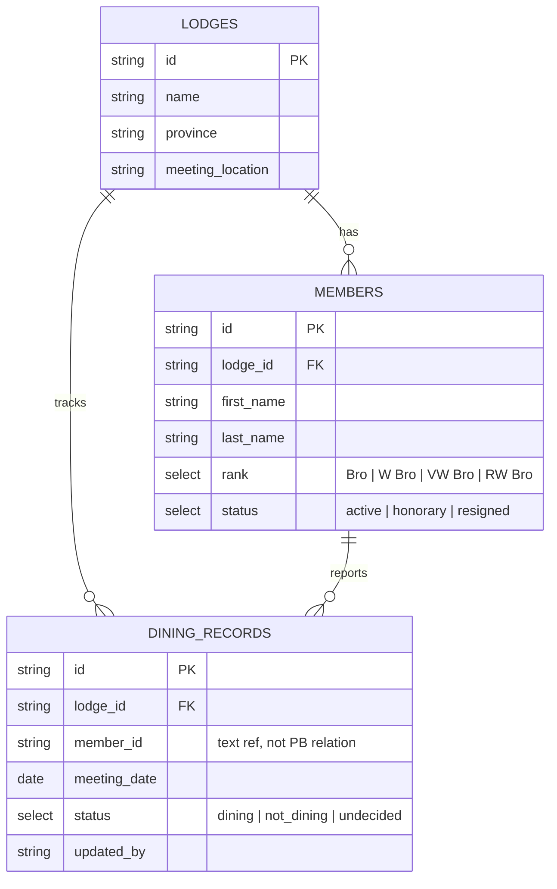

# Technical Architecture

**Decisions:** See [ADRs](decisions/) for rationale behind each technology choice.

---

## System Context

**Phase 1 scope:** Lodge Secretary SPA only. Member app is deferred.

---

## Client-Side Architecture

### Layer responsibilities

| Layer | Role | Example |
|-------|------|---------|
| **Pages** | Fetch data, orchestrate state, handle routing | `DiningPage.vue` |
| **Components** | Render props, emit events, no direct data access | `DiningTable.vue`, `LodgeCard.vue` |
| **Composables** | Encapsulate reusable logic (queries, mutations, sync) | `useDiningDashboardQuery()`, `useMutationQueue()` |
| **Stores** | Global reactive state | `useLodgeStore`, `useMutationQueueStore` |
| **Pinia Colada** | Server state caching, mutations, optimistic updates | `useQuery`, `useMutation` definitions |
| **Services** | PocketBase SDK wrapper, repository-light pattern | `dining-repository.ts`, `lodge-repository.ts` |
| **Offline Queue** | IndexedDB persistence, mutation collapse, replay on reconnect | `mutation-queue.ts` |

---

## Data Flow: Realtime Sync

---

## Data Model (Phase 1)

Collections map to PocketBase tables. The service layer transforms PocketBase records into typed domain objects (repository-light pattern — see [ADR-002](decisions/ADR-002-pocketbase.md)).

---

## Offline Architecture

The offline system has three layers, each with a single responsibility:

| Layer | File | Role |
|-------|------|------|
| **IndexedDB service** | `mutation-queue.ts` | Pure I/O — enqueue, dequeue, collapse, query |
| **Pinia store** | `useMutationQueueStore` | Reactive bridge — exposes `queuedMemberIds`, `syncingMemberIds` for UI binding |
| **Composable** | `useMutationQueue()` | Orchestration — `processQueue`, `syncOne`, retry with backoff, cache patching |

### Mutation collapse

When a member's dining status is toggled multiple times while offline, only the final state survives. The IndexedDB service uses an index on `memberId` — if a mutation for the same member already exists, it's replaced in the same transaction.

### Queue flush on reconnect

When `connectionStatus` transitions to `'connected'`, the composable processes the queue sequentially (oldest first):

1. Move mutation to "syncing" state (spinner icon)
2. PATCH or POST to PocketBase
3. Remove from IndexedDB and "queued" set
4. Patch the query cache immediately (prevents stale flash)
5. Remove from "syncing" set
6. Repeat for next mutation

If a sync fails, retry with exponential backoff (1s → 2s → 4s, max 30s, 3 attempts). If still failing or browser goes offline mid-sync, processing halts — unprocessed mutations stay in IndexedDB.

After all mutations are processed (or processing halts), the store re-syncs from IndexedDB and queries are invalidated (guarded by connection status to prevent error-state refetches).

### Connection detection

Two independent signal layers drive a three-state model (`connected` → `reconnecting` → `offline`):

- **SSE layer:** `pb.realtime.onDisconnect` + `PB_CONNECT` subscription — authoritative but unreliable after prolonged offline (SDK may exhaust its reconnect backoff)
- **Browser layer:** `window` `online`/`offline` events — coarse but reliable; triggers a reconnect poll that checks `pb.realtime.isConnected` until the SSE stream recovers

A 2-second debounce absorbs transient blips before showing "Offline". A 30-second deadline on the reconnect poll prevents indefinite polling.

See [ADR-010](decisions/ADR-010-offline-queue-architecture.md) and [ADR-011](decisions/ADR-011-dual-layer-connection-detection.md) for decision rationale.

---

## Deployment

| Environment | App Hosting | Backend | Purpose |
|-------------|-------------|---------|---------|
| **Dev** | `localhost:9000` (Quasar dev) | Local PocketBase (`pocketbase_0.36.3/`) | Development |
| **Staging** | Vercel (preview deploys) | PocketHost instance | PR previews |
| **Production** | Vercel | PocketHost instance | Demo / review |
| **CI** | `http-server` (built SPA) | Mocked (Playwright route intercepts) | Automated tests |

**CI pipeline:** GitHub Actions → install → lint → unit tests → E2E (Playwright with mocked PocketBase routes) → deploy preview.

**Histoire:** Component showcase hosted separately on Vercel for design review.
