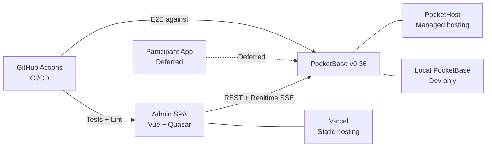
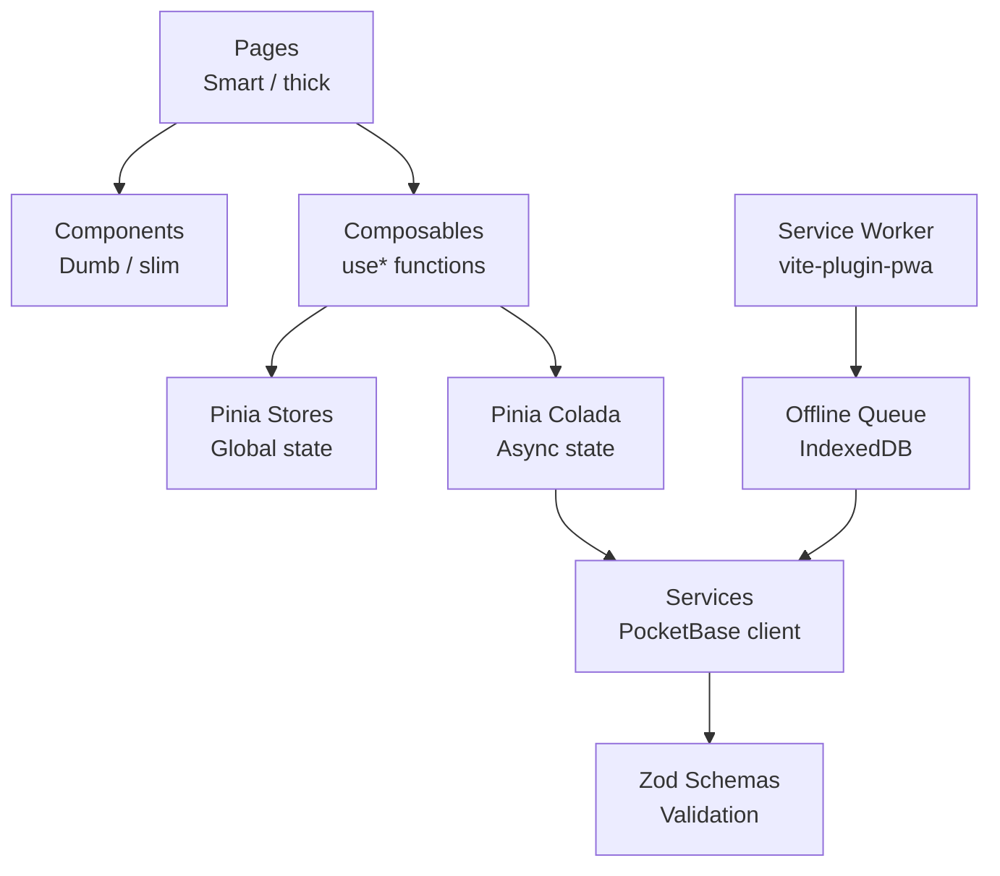
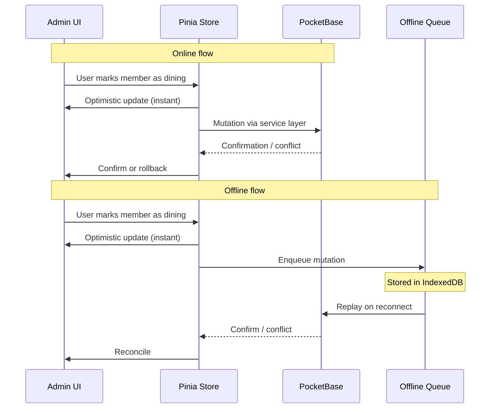
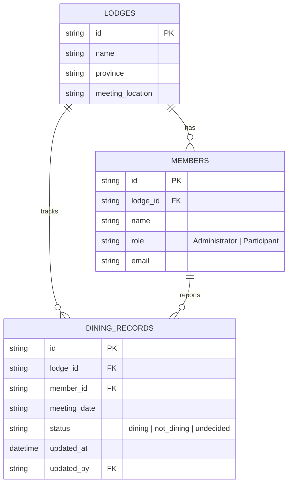

# Technical Architecture

**Decisions:** See [ADRs](decisions/) for rationale behind each technology choice.

---

## System Context

**Phase 1 scope:** Admin SPA only. Participant app is deferred.

---

## Client-Side Architecture

### Layer responsibilities

| Layer | Role | Example |
|-------|------|---------|
| **Pages** | Fetch data, orchestrate state, handle routing | `DiningDashboardPage.vue` |
| **Components** | Render props, emit events, no direct data access | `DiningCountCard.vue` |
| **Composables** | Encapsulate reusable logic (subscriptions, sync) | `useDiningSync()` |
| **Stores** | Global reactive state | `useDiningStore` |
| **Pinia Colada** | Server state caching, mutations, optimistic updates | Query/mutation definitions |
| **Services** | PocketBase SDK wrapper, repository-light pattern | `diningService.ts` |
| **Schemas** | Zod validation at system boundaries | `memberEntrySchema` |
| **Service Worker** | Asset caching, offline queue replay | Workbox via vite-plugin-pwa |

---

## Data Flow: Realtime Sync

---

## Data Model (Phase 1)

Collections map to PocketBase tables. The service layer transforms PocketBase records into typed domain objects (repository-light pattern — see [ADR-002](decisions/ADR-002-pocketbase.md)).

---

## Deployment

| Environment | App Hosting | Backend | Purpose |
|-------------|-------------|---------|---------|
| **Dev** | `localhost:9000` (Quasar dev) | Local PocketBase (`pocketbase_0.36.3/`) | Development |
| **Staging** | Vercel (preview deploys) | PocketHost instance | PR previews, CI E2E |
| **Production** | Vercel | PocketHost instance | Demo / review |

**CI pipeline:** GitHub Actions → install → lint → unit tests → E2E (Playwright against PocketHost) → deploy preview.

**Histoire:** Component showcase hosted separately on Vercel for design review.
