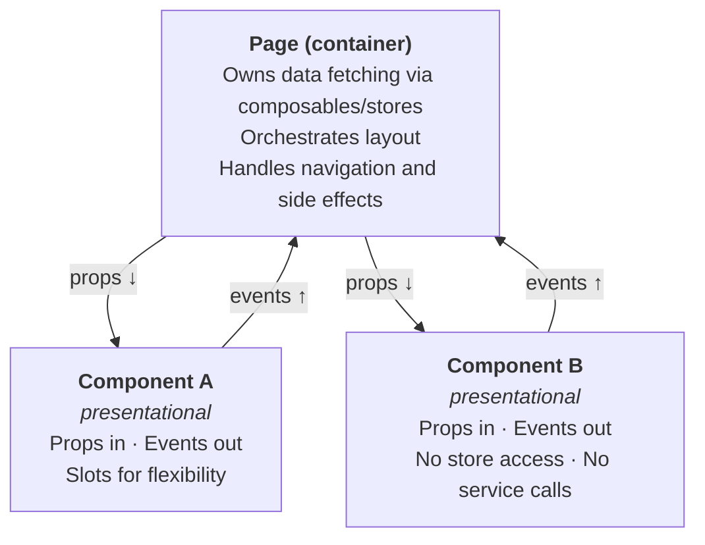

# Component Design Rationale

**Pattern:** Container pages, presentational components.

**Goal:** Testable, reusable UI with clear data ownership.

---

## The Pattern



### Rules

1. **Pages** call composables, access stores, fetch data. They pass data down via props
2. **Components** receive props, emit events. They never import stores or call services directly
3. **Components define their own prop interfaces** — the component decides what it needs, not the backend schema
4. **Slots** are preferred over deep prop drilling — keeps components flat and reusable

---

## Concrete Example: Dining Dashboard

```vue
<!-- DiningPage.vue (container) -->
<template>
  <q-page padding>
    <h1 class="page-title">Festive Board Dining</h1>

    <div v-if="isPending" role="status">
      <q-skeleton type="rect" height="44px" class="q-mb-sm" />
      <q-skeleton type="rect" height="300px" />
    </div>

    <q-banner v-else-if="error" type="negative" role="alert" class="q-mb-md">
      Failed to load dining data. Check that PocketBase is running.
    </q-banner>

    <template v-else-if="rows.length > 0">
      <div class="summary-chips q-mb-sm" aria-live="polite">
        <q-chip outline color="green-9" icon="check_circle" size="md">
          {{ diningCount }} dining
        </q-chip>
        <!-- ... -->
      </div>

      <DiningTable
        :rows="rows"
        :loading="isPending"
        :pending-member-ids="pendingMemberIds"
        :queued-member-ids="mutationQueueStore.queuedMemberIds"
        :syncing-member-ids="mutationQueueStore.syncingMemberIds"
        @toggle-status="handleToggle"
      />
    </template>
  </q-page>
</template>

<script setup lang="ts">
const { data, error, isPending } = useDiningDashboardQuery(lodgeId)
const { mutate, pendingMemberIds } = useDiningMutation(lodgeId)
const mutationQueueStore = useMutationQueueStore()

function handleToggle(memberId: string, newStatus: DiningStatus, diningRecordId: string | null) {
  mutate({ memberId, diningRecordId, newStatus })
}
</script>
```

```vue
<!-- DiningTable.vue (presentational) -->
<script setup lang="ts">
interface Props {
  rows: DiningTableRow[]
  loading: boolean
  pendingMemberIds: Set<string>
  queuedMemberIds: Set<string>
  syncingMemberIds: Set<string>
}
defineProps<Props>()

const emit = defineEmits<{
  'toggle-status': [memberId: string, newStatus: DiningStatus, diningRecordId: string | null]
}>()
// No store imports. No service calls. Just props and events.
</script>
```

### Why this works

| Concern | Where it lives | Benefit |
|---------|---------------|---------|
| Data fetching | Page + composables (`useDiningDashboardQuery`) | One place to debug data issues |
| Rendering | Component (`DiningTable`) | Test with props alone — no mocking stores |
| User interaction | Component emits `toggle-status` → page calls `mutate()` | Clear data flow, easy to trace |
| Offline state | Page reads from `mutationQueueStore`, passes as props | Component doesn't know about offline — just renders icons |
| Testing | Unit test components with props; E2E test pages | Fast unit tests, meaningful E2E tests |

### What we avoid

- **God components** — components that fetch their own data, manage their own state, and render. Hard to test, hard to reuse
- **Prop drilling > 2 levels** — if data needs to pass through multiple layers, use a slot or a composable instead
- **Renderless components** — useful in libraries, overkill for an application. Composables (`use*` functions) achieve the same logic reuse with less indirection
