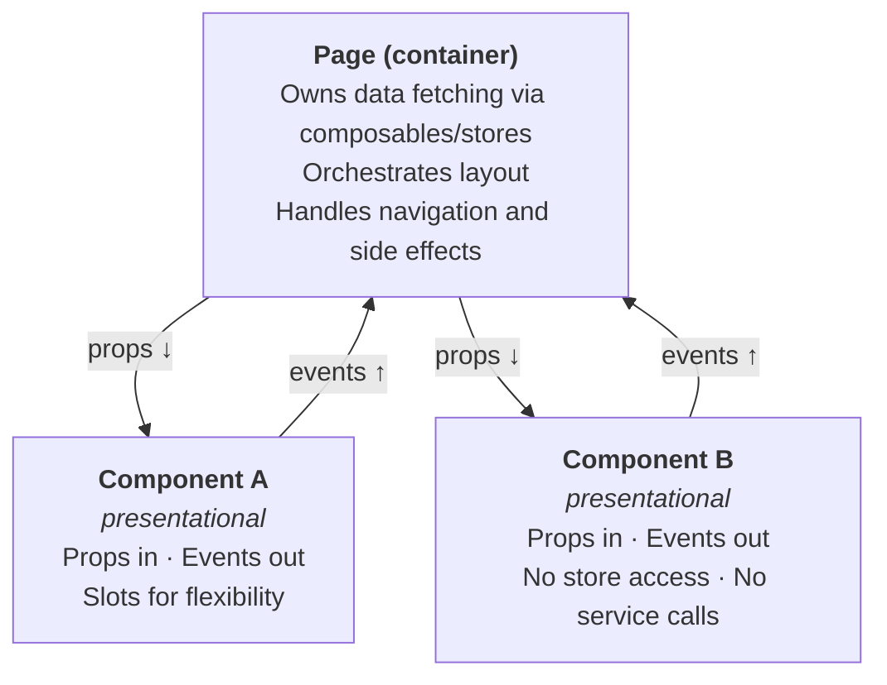

# Component Design Rationale

**Pattern:** Container pages, presentational components.

**Goal:** Testable, reusable UI with clear data ownership.

---

## The Pattern



### Rules

1. **Pages** call composables, access stores, fetch data. They pass data down via props
2. **Components** receive props, emit events. They never import stores or call services directly
3. **Components define their own prop interfaces** — the component decides what it needs, not the backend schema
4. **Slots** are preferred over deep prop drilling — keeps components flat and reusable

---

## Concrete Example: Dining Dashboard

```vue
<!-- DiningDashboardPage.vue (container) -->
<template>
  <q-page padding>
    <ConnectionStatus :status="connectionStatus" />

    <DiningCountCard
      :total="diningCounts.total"
      :dining="diningCounts.dining"
      :not-dining="diningCounts.notDining"
      :undecided="diningCounts.undecided"
    />

    <MemberList
      :members="members"
      @update-status="handleStatusUpdate"
    >
      <template #actions="{ member }">
        <DiningToggle
          :status="member.diningStatus"
          @change="(status) => handleStatusUpdate(member.id, status)"
        />
      </template>
    </MemberList>
  </q-page>
</template>

<script setup lang="ts">
const { members, diningCounts, updateMemberStatus } = useDiningSync()
const { connectionStatus } = useConnectionStatus()

async function handleStatusUpdate(memberId: string, status: DiningStatus) {
  await updateMemberStatus(memberId, status) // optimistic update inside
}
</script>
```

```vue
<!-- DiningCountCard.vue (presentational) -->
<template>
  <q-card>
    <q-card-section>
      <div class="text-h6">Dining Numbers</div>
      <div>{{ dining }} / {{ total }} confirmed</div>
      <div v-if="undecided > 0">{{ undecided }} undecided</div>
    </q-card-section>
  </q-card>
</template>

<script setup lang="ts">
interface Props {
  total: number
  dining: number
  notDining: number
  undecided: number
}
defineProps<Props>()
// No store imports. No service calls. Just props.
</script>
```

### Why this works

| Concern | Where it lives | Benefit |
|---------|---------------|---------|
| Data fetching | Page + composable | One place to debug data issues |
| Rendering | Component | Test with props alone — no mocking stores |
| User interaction | Component emits event → page handles | Clear data flow, easy to trace |
| Reuse | Slots + props | `MemberList` works for any list with actions |
| Testing | Unit test components with props; E2E test pages | Fast unit tests, meaningful E2E tests |

### What we avoid

- **God components** — components that fetch their own data, manage their own state, and render. Hard to test, hard to reuse
- **Prop drilling > 2 levels** — if data needs to pass through multiple layers, use a slot or a composable instead
- **Renderless components** — useful in libraries, overkill for an application. Composables (`use*` functions) achieve the same logic reuse with less indirection
