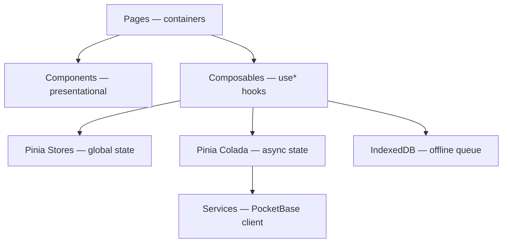

# Festive Board Manager — TLDR

A prototype dining attendance tracker for Lodge meetings, built to demonstrate front-end architecture, offline resilience, and accessibility practices aligned with UGLE's Senior Front-End Developer role.

**[Live App](https://festive-board-manager.vercel.app/)** · **[Component Showcase](https://festive-board-histoire.vercel.app/)** · **[GitHub](https://github.com/DarynHolmes/festive)**

---

## Team

| Role | Who | Responsibility |
|------|-----|----------------|
| Developer | Daryn Holmes | Architecture, UX direction, manual testing, quality oversight |
| Product Owner | Gem (Gemini Gem) | Requirements, acceptance criteria, domain language |
| Implementation Partner | Ada (Claude Code) | Code generation, test automation, research |

AI was used throughout — from high-level architecture to low-level coding. [Ada's Development Journal](../supporting-documentation/development-journal.md) records the collaboration: who found what, who fixed what, and the decisions that shaped the code.

---

## Architecture

Container pages fetch data and orchestrate state; presentational components receive props and emit events. The service layer decouples PocketBase record shapes from domain types.

**Realtime:** PocketBase SSE pushes updates to all connected clients. Toggling a member's dining status triggers an optimistic UI update, then confirms or rolls back on server response.

**Offline:** When connectivity drops, mutations queue in IndexedDB with collapse logic (toggling the same member 3 times stores only the final state). On reconnect, the queue replays sequentially with exponential backoff. Queued member IDs are filtered from realtime events to prevent stale server state overwriting user intent.

> **Detailed docs:** [Architecture](02_architecture.md) · [Component Design](03_component_design.md)

---

## Key Decisions

| Decision | Rationale | ADR |
|----------|-----------|-----|
| Vue 3 + Quasar SPA | Matches the job spec stack; Quasar provides accessible components and PWA support | [001](decisions/ADR-001-vue-spa.md), [004](decisions/ADR-004-quasar.md) |
| Offline-first with IndexedDB queue | Lodge buildings have thick walls and unreliable Wi-Fi; data loss is unacceptable | [003](decisions/ADR-003-offline-first.md) |
| Optimistic updates via Pinia Colada | Instant UI feedback; server confirmation in the background | [005](decisions/ADR-005-async-state.md) |
| PocketBase as backend | Realtime SSE, RBAC, REST API — plays the role of Laravel for the prototype | [002](decisions/ADR-002-pocketbase.md) |
| Playwright built-in mocking | No MSW dependency; tests run fully isolated with no backend | [006](decisions/ADR-006-test-mocking-strategy.md) |

---

## Quality Practices

- **E2E tests:** 14 Playwright tests covering dining flow, offline queuing, connectivity states, and accessibility
- **Accessibility audits:** axe-core (WCAG 2.2 AA) injected into every E2E test — violations fail the build
- **Unit tests:** Co-located with source; pure functions (mappers, time formatters, Zod schemas)
- **CI pipeline:** GitHub Actions — lint, unit tests, build, E2E on every push ([ci.yml](../.github/workflows/ci.yml))
- **Type safety:** Strict TypeScript, zero `any` types

---

## Accessibility

**Standard:** WCAG 2.2 AA · **Membership ages:** 18–90+

| Practice | Implementation |
|----------|---------------|
| Large hit targets | All interactive elements min 44x44px; status menu items 48px |
| High contrast | 4.5:1+ for all text; audited and overridden Quasar defaults |
| Screen reader support | `aria-live` regions for connection status and dining count changes |
| Keyboard navigation | Full keyboard operability; no complex gestures |
| Text scaling | Layout tested at 200% browser zoom |

> **Detailed docs:** [Accessibility Strategy](04_accessibility.md) · [Manual Testing](manual-testing/accessibility.md)

---

## Tech Stack → Job Spec

| Job Spec Requirement | Prototype Implementation |
|---------------------|--------------------------|
| Vue, TypeScript | Vue 3 Composition API, strict TypeScript throughout |
| Utility-based CSS frameworks | Quasar's utility classes + SCSS |
| Component design and state management | Container/presentational pattern; Pinia + Pinia Colada |
| Modular, reusable components for SPA and PWA | Histoire component showcase; PWA via vite-plugin-pwa |
| Automated Playwright test suites | 14 E2E tests + axe-core accessibility audits in CI |
| Integrate with backend APIs | PocketBase REST + realtime SSE (repository-light pattern) |
| Performance, accessibility, responsiveness | WCAG 2.2 AA, offline-first, optimistic updates |
| GitHub branches, merges, pull requests | GitHub Actions CI on push and PRs |
| Cross-browser and legacy compatibility | Chrome 80+ support for aging Lodge laptops |

---

## Deliberate Descoping

| What | Why |
|------|-----|
| Authentication & RBAC | PocketBase supports it; implementing login flows would consume time better spent on architecture depth |
| Member-facing app | Spec calls for two apps — deferred to focus on the Secretary SPA and go deep on one |
| Conflict resolution UI | The offline queue prevents most conflicts; a resolution UI adds complexity without proportional value at prototype stage |
| Server-side rendering | Hash-based SPA is simpler, PWA-friendly, and needs no server config — right trade-off for a prototype |
