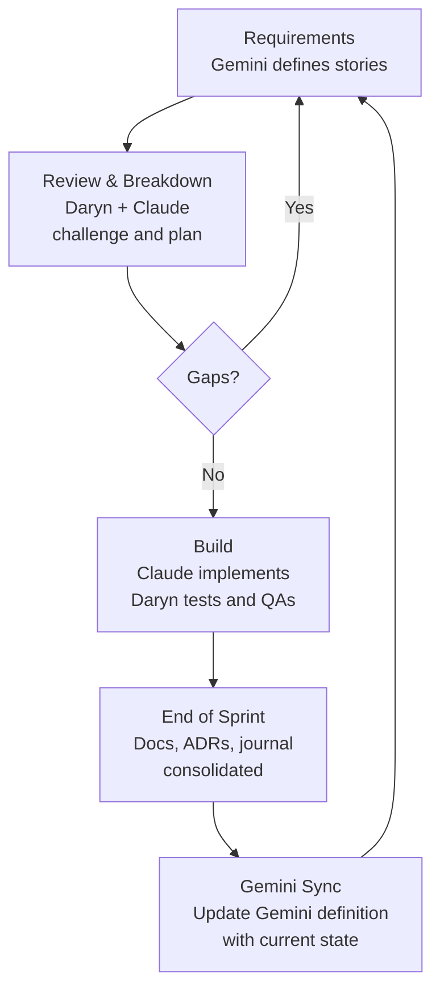

# Development Journal

This journal records how the prototype was built across five sprints — the decisions made, the bugs found, and how AI tools were used alongside developer oversight.

> Started from Sprint 2. Earlier sprints predate the journal.

## Roles & Tools

| Role | Who | Responsibility |
|------|-----|----------------|
| Developer | Daryn Holmes | Architecture, code review, UX direction, manual testing, quality oversight |
| Requirements | Gemini (custom Gem) | User stories, acceptance criteria, domain language |
| Implementation | Claude | Code generation, test automation, technical research |

## How We Work

Requirements are defined in Gemini using UGLE domain language — user stories, acceptance criteria, edge cases. Implementation plans and code are generated with AI assistance. Daryn reviews every plan before implementation begins, tests each feature manually in the browser, and challenges decisions from both sides. The codebase shows what was built. This journal captures what led to it.

### Sprint Flow

1. **Requirements** — Daryn gets the next set of requirements from Gemini and prepares them in the `documentation/requirements/wip/` folder, organised by sprint.

2. **Story review & breakdown** — Daryn and Claude review the stories together. For larger features they break them into individually testable tasks within the story folder (Sprint 3's offline queuing feature had nine task files, for example). Requirements are challenged early — gaps, prerequisites, and feasibility questions get raised before code starts.

3. **Feedback to Gemini** — If review surfaces a gap or a new prerequisite, it goes back to Gemini. This happened in Sprint 1: AI-assisted analysis flagged that the dining feature needed a proper members collection, which led to `00_members_collection.md` being added as a new requirement before Sprint 1 could proceed.

4. **Build** — Once the stories are agreed, implementation proceeds with AI-assisted code generation while Daryn oversees and QAs. Daryn tests each feature manually in the browser, which consistently surfaces issues that automated tests miss (reconnection bugs, visual regressions, race conditions). Fixes are iterative — Daryn identifies, the issue is diagnosed and patched, Daryn re-tests.

5. **End of sprint & Gemini sync** — Daryn confirms the sprint is done and a checklist is performed: consolidate journal entries, update docs, review ADRs and the todo backlog, and update the README. The Gemini definition (`supporting-documentation/gemini-gem.md`) is updated with the current state so that Gemini's next sprint requirements are grounded in what actually exists, not what was originally planned.

---

## Sprint 2: Offline Awareness & Connectivity Guardrails

**Spec:** `documentation/requirements/wip/sprint-2/01-offline-awareness.md`

### Plan Review

An 11-step implementation plan was drafted covering connection monitoring, staleness warnings, pending mutation indicators, and E2E tests. The plan was reviewed and approved.

One thing flagged during planning: the spec mentions "WebSocket" but PocketBase uses SSE (Server-Sent Events). Not a functional issue, but worth noting for accuracy.

### Implementation & Testing

The feature was implemented using AI-assisted code generation. Manual browser testing surfaced several issues automated tests missed:

**Reconnection bug** — Daryn toggled Chrome DevTools offline and back. The badge stuck at "Reconnecting." The diagnosis: PocketBase SDK exhausts its reconnect backoff while offline, so `PB_CONNECT` never fires when the network returns. A reconnect polling fallback was added. Daryn verified the fix and requested detailed comments explaining why both detection layers exist.

**Layout regressions** — Daryn spotted two visual issues after the sync icon wrapper was added: toggles shifted left (missing `justify-center`) and buttons flickered on toggle (`v-if` adding/removing DOM elements in a flex container — switched to `visibility: hidden`).

**PocketBase auto-cancellation race** — Daryn captured a `ClientResponseError` when toggling dining status. The cause was PocketBase's request auto-cancellation; `requestKey: null` was added as a workaround. (Later removed — see below.)

### Architectural Decisions

**Removing redundant invalidation** — Daryn questioned why we had both `invalidateQueries` in `onSuccess` and realtime event invalidation. Good question — they were racing each other. The broad `invalidateQueries` was replaced with a targeted cache patch, which fixed the root cause.

**Removing `requestKey: null`** — After the root cause was fixed, the question arose whether the workaround was still needed. The only remaining scenario was two simultaneous realtime events — theoretical. It was removed, applying the project's own YAGNI principle.

**E2E test hygiene** — An audit checked whether the E2E tests respected ADR-008 and found duplicated mock setup across spec files and a CSS selector where a semantic locator should be. The cleanup included adding a YAGNI clause to the ADR.

**Offline mutation queuing** — The spec didn't cover offline mutation behaviour — mutations fail and roll back when offline. The gap was documented in `documentation/requirements/todo/` rather than built speculatively.

### Pre-existing Issues Discovered

Sprint 2 work uncovered two issues that predated the sprint:

- `QBtnToggle` renders `button` roles, not `radio` — the E2E tests were using the wrong role selector
- Quasar's `bg-positive` green (#21ba45) with white text fails WCAG AA contrast (2.56:1) — switched to `outline` variant with darker colours

---

## Sprint 3: Offline Mutation Queuing & Local Persistence

**Spec:** `documentation/requirements/wip/sprint-3/01_offline-mutation-queing_local_persistence.md`

### Planning

The spec included detailed edge cases (session expiry while offline, app closure with pending queue, conflict with realtime events). The implementation plan was reviewed and broken into nine individually testable task files.

Key architectural decision: three-layer separation for the queue — IndexedDB service (pure I/O), Pinia store (reactive bridge), composable (orchestration). Settled on a Pinia store over provide/inject because it's the established pattern for global reactive state.

### Implementation

Built four layers: an IndexedDB service (`mutation-queue.ts`) with mutation collapse (same member toggled three times offline → only the final state kept), a Pinia store as the reactive bridge, an orchestration composable (`useMutationQueue`) with sequential sync and backoff, and UI wiring across `DiningTable`, `DiningPage`, and `MainLayout`. ESLint flagged `max-depth` in `processQueue` — extracted `syncOne` to keep the main loop clean.

During review, an edge case was identified: what if connection drops mid-sync, after a mutation moves to "syncing" but before the API call completes? Answer: the mutation stays in IndexedDB (only removed on success) and the store re-syncs in the outer `finally`. A test helper (`_resetDbForTesting`) mixed into production code was also caught and removed.

Manual testing surfaced three defects:

**Stale cache after sync** — After queue flushed, the toggle briefly reverted to the old server state. Realtime events for queued members were filtered during sync, but no cache invalidation followed. Fix: explicit `invalidateQueries` after `refreshStore()`.

**Icon priority order** — Clock icon persisted during sync instead of showing spinner. The `v-if` chain checked queued before syncing, and queued wasn't cleared until the end. Fix: reversed the check order and added `removeQueued()` after each successful sync.

**Mid-sync offline error** — Going offline mid-sync triggered the error banner. The `invalidateQueries` ran unconditionally, triggering a refetch while offline. Fix: guard with connection status check.

All three defects were resolved through the iterative find-diagnose-patch-retest cycle, and the feature was stable after the final round of manual testing.

### E2E Tests & Their Limits

Seven E2E tests pass reliably (connectivity badges, sync icons, offline states, axe-core accessibility). The full reconnect → queue-flush → sync flow proved unreliable (~80% pass rate) — the reconnect signal depends on PocketBase's SSE reconnection, which is non-deterministic without a real server. Pragmatic decision: dropped the flaky test and wrote a manual test guide (`documentation/manual-testing/offline-mutation-queuing.md`) with 8 test cases covering the gaps.

### Observations

All five defects this sprint stemmed from the same root cause: reactive state transitions during sequential async processing. Each mutation passes through three states (queued → syncing → done), and the UI reads from multiple reactive sources simultaneously. When one source updated before another, the UI briefly showed incorrect state. The code is now commented about *why* the ordering matters.

Bonus find during E2E work: the staleness banner (`bg-warning text-white`) had a contrast ratio of 1.69:1 — axe-core caught it. Changed to `text-dark` to meet WCAG AA. A Sprint 2 issue that slipped through because the banner only appears after 5 minutes offline.

### UX Polish

After the core feature was complete, Daryn reviewed the dining page visually and directed a series of UX improvements. Two changes in particular were Daryn's initiative:

**Interaction pattern overhaul** — Daryn replaced the `QBtnToggle` (three buttons always visible per row) with a single status button that opens a context menu on click. This decluttered the table — each row now shows one button reflecting the current status, and the full option set only appears when the user interacts. Calmer and better suited to the elderly-friendly design goal.

**Colour philosophy** — Daryn reworked the status colours to be calm and non-judgmental. The original palette used red for "Not Dining," which implied something was wrong with choosing not to dine. Daryn chose blue-grey instead — a neutral tone that respects the member's choice. The overall effect is a UI that informs without pressuring.

Other collaborative changes included WCAG contrast fixes (original status colours failed AA), touch-friendly menu sizing (48px item height, exceeding the 44px minimum), and active row highlighting so the user always knows which member they're changing.

---

## Sprint 4: Interview Readiness

**Spec:** `documentation/requirements/wip/sprint-4/00_epic.md`

### Story 01 — Live Deployment

Deployed the Secretary app to Vercel with PocketBase hosted on PocketHost. Daryn created the production instance, applied migrations, and seeded data. Hash-based routing worked out of the box — no rewrite rules needed.

Daryn decided to flatten the git history to a single commit before making the repo visible to the interview panel. Smoke test passed: lodge dashboard, dining toggles, realtime sync across tabs, and offline queue behaviour all verified.

### Story 02 — GitHub Actions CI

Created `.github/workflows/ci.yml` — lint, unit tests, build, Playwright E2E on every push to `main` and all PRs. Took four runs to get green:

1. **Runs 1–2:** All 14 E2E tests timed out. Vite's dev server returns HTTP 200 before JS compiles — Playwright thought the server was ready but Vue never mounted. **Fix:** Build first, serve static files with `http-server`.

2. **Run 3:** Playwright trace showed a blank page. Console error: `VITE_POCKETBASE_URL is not defined` — `.env.*` files are gitignored, so CI had no env vars. This possibility was flagged early; it should have been caught sooner. **Fix:** Set the env var on the Build step.

3. **Run 4:** 10/14 passed. Remaining 4: connection badge showed "Offline" because there's no PocketBase server in CI. **Fix:** Mocked the SSE endpoint in test setup (`mockRealtimeConnection`).

### Story 03 — Histoire Component Showcase

Set up Histoire for the component showcase. Integrating with Quasar required manual plumbing — Histoire runs its own Vite instance outside Quasar's `@quasar/app-vite` pipeline, so SCSS variables, Vue plugin registration, and SSR guards all needed explicit configuration. Created stories for `LodgeCard` and `DiningTable` with realistic UGLE data. Deployed to Vercel.

---

## Sprint 5: Test Dashboard & Quality Visibility

### Story 01 — Surface Test Results

**Spec:** `documentation/requirements/done/sprint-5/01_surface_test_results.md`

Goal: make CI results visible within 1 click from the README — all four checks (lint, unit, build, E2E) in a single dashboard, deployed automatically on every push to main.

Created `.github/scripts/ci-report.mjs` — a Node script that generates both a GitHub Actions Job Summary and a self-contained HTML dashboard. The script went through three forms: inline YAML (~400 lines), bash script (at Daryn's request), then JavaScript (also Daryn's call). Template literals and native JSON parsing made the dashboard generation significantly cleaner than the bash heredoc version. Dashboard deployed to GitHub Pages with the Playwright HTML report alongside it.

**Bug: unit test report missing** — Dashboard showed "Failed (no report)" for unit tests despite them passing. Root cause: vitest wrote to `test-results/`, then Playwright cleaned that directory before E2E tests ran. Fix: changed vitest output to `reports/unit.json`.

The dashboard uses collapsible detail sections (unit tests grouped by file, lint warnings by rule) and a single-column stacked layout — card order chosen by Daryn. It demonstrates CI maturity without the overhead of SonarQube, which aligns with ADR-009.

### Story 02 — Review Documentation

**Spec:** `documentation/requirements/done/sprint-5/02_review_documentation.md`

Systematic review of all project documentation against the actual codebase. Eight task areas: architecture docs, component design, ADR review, diagram audit, manual testing guides, TLDR, README, and supporting docs.

The review surfaced some stale content and missing coverage — docs were updated to reflect the Sprint 4 state accurately. ADR "revisit" clauses were checked; none of the trigger conditions have been met yet (app is still well under 8 views, no Vitest component tests needing MSW, no SEO requirements, and still in prototype phase). The architecture_gaps.md in `todo/` (auth & RBAC, interactive reconciliation) remains valid deferred work for future sprints.
